# GitHub Star Auto Classification

🌟 AI-powered tool to automatically classify GitHub starred repositories into different star lists, supporting both automatic updates and existing list modes.

## Features

- 🤖 **AI-Driven Analysis**: Uses OpenAI compatible interfaces to analyze repository tech stacks, purposes, and topics
- 📋 **Dual Operation Modes**:
  - **Auto Mode**: AI automatically creates and updates star lists
  - **Existing Lists Mode**: Classifies based on user's existing star lists
- ⚡ **GitHub Actions Support**: Supports scheduled execution and manual triggers
- 🔧 **Flexible Configuration**: Supports custom classification standards, exclusion rules, etc.
- 🔍 **Dry Run Mode**: Test classification effects without actually modifying star lists
- 📊 **Detailed Logging**: Complete classification process and result reports
- ✨ **Smart Summary Completion**: AI-powered auto-completion and enhancement of list descriptions
- 📦 **Modern Package Management**: Uses UV for fast and reliable dependency management

## Quick Start

### 1. Clone the Project

```bash
git clone https://github.com/your-username/star-tidy.git
cd star-tidy
```

### 2. Install Dependencies

```bash
# Install UV (if not already installed)
curl -LsSf https://astral.sh/uv/install.sh | sh

# Install project dependencies
uv sync
```

### 3. Configure Environment Variables

Create a `.env` file or set environment variables:

```bash
export GITHUB_TOKEN="ghp_xxxxxxxxxxxxxxxxxxxx"  # GitHub Personal Access Token
export OPENAI_API_KEY="sk-xxxxxxxxxxxxxxxxxxxx"   # OpenAI API Key
export OPENAI_API_BASE="https://api.openai.com/v1"  # Optional, for compatible services
export AI_MODEL="gpt-4o-mini"  # Optional, default model
```

### 4. Run Classification

```bash
# Quick start (runs with default settings)
uv run star-tidy

# Or using python directly
uv run python main.py

# Dry run mode (test without actual changes)
uv run star-tidy star --dry-run

# Verbose logging
uv run star-tidy --verbose

# With summary options
uv run star-tidy star --auto-complete-summaries --enhance-existing-summaries

# Exclude specific repositories
uv run star-tidy star --exclude-repo "user/repo1" --exclude-repo "user/repo2"

# Use existing lists mode
uv run star-tidy star --mode existing_lists

# Interactive setup wizard
uv run star-tidy setup

# Use alternative LLM providers
uv run star-tidy star --api-base https://api.deepseek.com --ai-model deepseek-chat
uv run star-tidy star --api-base https://api.groq.com/openai/v1 --ai-model llama3-8b-8192
```

## CLI Commands

The tool provides several commands for different operations:

### Main Commands

```bash
# Show help and available commands
uv run star-tidy --help

# Run star classification (default command)
uv run star-tidy star [OPTIONS]

# Show current configuration
uv run star-tidy config

# Interactive setup wizard
uv run star-tidy setup

# Run system tests
uv run star-tidy test

# Test LLM connection
uv run star-tidy test-llm

# Legacy Q&A mode
uv run star-tidy qa
```

### Star Command Options

```bash
# Classification modes
--mode auto                    # Create new lists automatically (default)
--mode existing_lists          # Use existing star lists

# Summary options
--auto-complete-summaries      # Auto-complete missing descriptions
--enhance-existing-summaries   # Enhance existing descriptions
--use-ai-summary              # Use AI for summary generation
--include-stats               # Include repository statistics

# Repository filtering
--exclude-repo "user/repo"     # Exclude specific repositories (repeatable)

# LLM Configuration
--ai-model gpt-4o-mini         # AI model to use
--api-base https://api.openai.com/v1  # API base URL for compatible services
--max-tokens 1000              # Maximum tokens to generate
--temperature 0.7              # Sampling temperature (0-2)

# Configuration
--config path/to/config.yaml   # Use specific config file
--dry-run                     # Test mode (no actual changes)
```

### Interactive Setup

```bash
# Set up configuration interactively
uv run star-tidy setup

# Advanced setup with custom config file
uv run star-tidy setup --config-file my-config.yaml
```

## Configuration Options

### Environment Variables

| Variable | Required | Default | Description |
|----------|----------|---------|-------------|
| `GITHUB_TOKEN` | Yes | - | GitHub Personal Access Token |
| `OPENAI_API_KEY` | Yes | - | OpenAI API Key |
| `OPENAI_API_BASE` | No | `https://api.openai.com/v1` | API Base URL |
| `AI_MODEL` | No | `gpt-4o-mini` | AI Model to use |
| `STAR_TIDY_MODE` | No | `auto` | Run mode (`auto` or `existing_lists`) |
| `DRY_RUN` | No | `false` | Whether to run in dry-run mode |
| `AUTO_COMPLETE_SUMMARIES` | No | `true` | Auto-complete missing descriptions |
| `ENHANCE_EXISTING_SUMMARIES` | No | `true` | Enhance existing descriptions |
| `MAX_TOKENS` | No | - | Maximum tokens to generate |
| `TEMPERATURE` | No | - | Sampling temperature (0-2) |

### Configuration File

Copy `config.example.yaml` to `config.yaml` and customize as needed:

```yaml
mode: "auto"  # or "existing_lists"
exclude_repos:
  - "user/repo-to-exclude"
dry_run: false
summary_options:
  auto_complete: true
  enhance_existing: true
  use_ai_summary: true
  include_stats: true
```

## GitHub Actions Setup

### 1. Configure Secrets

Add the following Secrets in your GitHub repository settings:

- `OPENAI_API_KEY`: OpenAI API Key
- Optional: `OPENAI_API_BASE`, `AI_MODEL`

### 2. Enable Actions

The project includes pre-configured GitHub Actions workflow:

- **Manual Trigger**: Run manually from Actions page with customizable options
- **Scheduled Execution**: Automatically runs every Sunday at 2 AM
- **Custom Trigger**: Modify `.github/workflows/star-classification.yml`

### 3. New Summary Options

The workflow now supports additional options:
- Auto-complete missing list descriptions
- Enhance existing list descriptions
- Configurable through workflow inputs

## Operation Modes

### Auto Mode (`auto`)

AI automatically analyzes repositories and creates new star lists:

- Automatically categorizes based on tech stack, purpose, etc.
- Creates semantic category names
- AI-powered list descriptions with statistics
- Suitable for starting fresh organization of star lists

### Existing Lists Mode (`existing_lists`)

Classifies based on user's existing star lists:

- Uses existing classifications as reference
- Assigns new repositories to appropriate existing categories
- Auto-completes missing list descriptions
- Enhances existing descriptions with updated information
- Suitable for maintaining existing classification systems

## Project Architecture

This project is built on [Pocket Flow](https://github.com/The-Pocket/PocketFlow) framework using Agentic Coding design patterns:

### System Overview

```mermaid
flowchart TD
    A[User/GitHub Actions] --> B[main.py]
    B --> C[Star Classification Flow]
    
    subgraph Flow["Star Classification Workflow"]
        D[InitializeNode<br/>Config & API Validation] --> E[FetchStarredReposNode<br/>Get Starred Repositories]
        E --> F[ModeDecisionNode<br/>Choose Mode & Get Existing Lists]
        F --> G[AnalyzeRepositoriesNode<br/>AI Batch Analysis<br/>BatchNode]
        G --> H[ManageStarListsNode<br/>Smart List Management<br/>+ Summary Completion]
    end
    
    C --> D
    
    subgraph Utils["Utility Functions"]
        I[config.py<br/>Configuration Management<br/>+ Summary Options]
        J[github_client.py<br/>GitHub API Client<br/>+ List Management]
        K[repo_analyzer.py<br/>AI Repository Analyzer<br/>+ Classification Logic]
        L[star_list_manager.py<br/>Smart Star List Manager<br/>+ AI Summary Generation]
        M[call_llm.py<br/>LLM API Calls<br/>OpenAI Compatible]
    end
    
    D --> I
    E --> J
    F --> J
    G --> K
    H --> L
    K --> M
    L --> M
    
    subgraph External["External APIs"]
        N[GitHub API<br/>• Starred Repos<br/>• Star Lists<br/>• Repository Info]
        O[OpenAI Compatible API<br/>• Repository Analysis<br/>• Smart Summaries<br/>• Description Enhancement]
    end
    
    J --> N
    M --> O
    
    subgraph Results["Output Results"]
        P[Organized Star Lists<br/>• Auto-created Categories<br/>• Smart AI Descriptions<br/>• Enhanced Summaries]
        Q[Classification Report<br/>• Category Statistics<br/>• Processing Results<br/>• Summary Enhancements]
        R[System Logs<br/>• Execution Details<br/>• Error Handling<br/>• Performance Metrics]
    end
    
    H --> P
    H --> Q
    B --> R
    
    subgraph Config["Configuration Sources"]
        S[Environment Variables<br/>• API Keys<br/>• Basic Settings<br/>• Summary Options]
        T[Config Files<br/>• YAML Configuration<br/>• Custom Categories<br/>• Advanced Options]
        U[Command Line Args<br/>• Runtime Options<br/>• Summary Control<br/>• Debug Flags]
    end
    
    S --> I
    T --> I
    U --> I
    
    subgraph Features["Key Features"]
        V[🤖 AI-Powered Analysis<br/>• Tech Stack Detection<br/>• Purpose Classification<br/>• Smart Categorization]
        W[📋 Dual Modes<br/>• Auto Mode<br/>• Existing Lists Mode<br/>• Flexible Operation]
        X[✨ Smart Summaries<br/>• Auto-completion<br/>• Enhancement<br/>• Statistics Integration]
        Y[🔍 Dry Run Support<br/>• Safe Testing<br/>• Preview Results<br/>• No Modifications]
    end
    
    style D fill:#e1f5fe
    style G fill:#fff3e0
    style H fill:#e8f5e8
    style L fill:#f3e5f5
    style M fill:#fce4ec
    style N fill:#f3e5f5
    style O fill:#f3e5f5
    style P fill:#e8f5e8
    style X fill:#fff3e0
```



### Directory Structure

```
star-tidy/
├── main.py              # Main program entry
├── flow.py              # Flow definitions
├── nodes.py             # Core node implementations
├── utils/               # Utility functions
│   ├── call_llm.py      # LLM API calls
│   ├── github_client.py # GitHub API client
│   ├── repo_analyzer.py # Repository analyzer
│   ├── star_list_manager.py # Star List manager with smart summaries
│   └── config.py        # Configuration management
├── .github/workflows/   # GitHub Actions configuration
├── pyproject.toml       # UV project configuration
└── docs/               # Design documentation
```

## Development Guide

- View [Design Documentation](docs/design.md) to understand system architecture
- Use [Agentic Coding Guide](https://the-pocket.github.io/PocketFlow/guide.html) for development
- Install development dependencies: `uv sync --extra dev`
- Run tests: `uv run pytest`
- Format code: `uv run black .`
- Lint code: `uv run ruff check`

## License

MIT License
